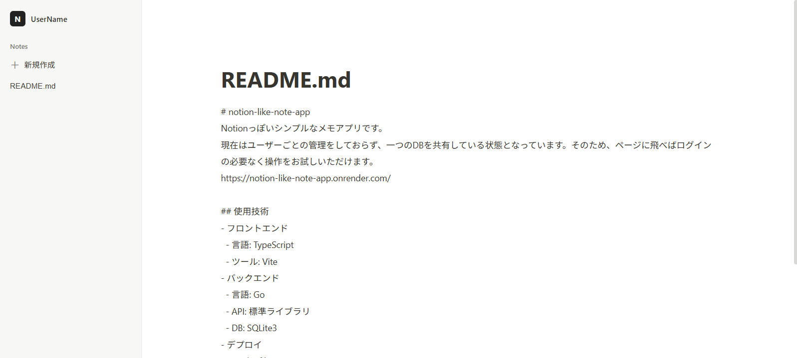

# notion-like-note-app
Notionっぽいシンプルなメモアプリです。転職用のポートフォリオとして作りましたが、継続的にアップデートしていく予定です。  
現在はユーザーごとの管理をしておらず、一つのDBを共有している状態となっています。そのため、ページに飛べばログインの必要なく操作をお試しいただけます。  
https://notion-like-note-app.onrender.com/

## コンセプト
Notionから自分が普段使っていない機能をそぎ落としたシンプルなブラウザのメモアプリ

## 開発の背景
私はリッチなWebアプリは高機能な反面、初期の読み込みが遅かったり、メモリ消費が大きかったりしがちと感じています。そのため、軽くて余計なボタンがないシンプルなメモアプリがほしいと考えこのWebアプリを開発するに至りました。

## 使用技術
- フロントエンド
  - 言語: TypeScript
  - ツール: Vite
- バックエンド
  - 言語: Go
  - API: 標準ライブラリ
  - DB: SQLite3
- デプロイ
  - Dockerfile
  - Render(PaaS)

## 技術選定理由
- 使用言語やツールは主に学習コストの低さと開発効率の高さから選定しました。
- CI/CDにRenderを使用したことについては、上記のような理由もありますが、何より金がかかる恐れがないというのが大きな理由です。

## 現状の機能一覧
- 新規作成(Create)
- 一覧表示、選択(Read)
- 編集(Update)
- 削除(Delete)

## 今後追加予定の機能
2026/09/22現在、まだMVPのような状態なので下記機能の追加を予定しています。
- リンクを入力された際に判別してクリック可能にする
- ユーザー識別
- 見出し、小見出し追加
- リンク共有

## 追加しない予定の機能
以下は当初のコンセプトから、追加しない予定の機能ですが、今後使用者の意見を取り入れる中で追加することになるかもしれません。
- フォント、色変更
- Markdownパーサー

## 開発により得られた成果(2026/09/22)
- Go: net/httpによるWebサーバーの実装方法。DBドライバーの扱い方。
- TS: 非同期処理に関する理解。Promise型の扱い方。

## 反省点(2026/09/22)
- 知識不足からデプロイ時にビルドに手間取った。Dockerfileに関しては99%AI頼りだったため、学習による理解が必要。
- コミット粒度がバラバラ。非常に追いづらい履歴となってしまっている。また、無理に英語を使おうとしてメッセージも読みにくくなっている。コミット粒度をそろえることを強く意識する、あるいは強制するためのツールを導入して改善する必要あり。
- DBのテーブルが1つのみでありせっかくのWebアプリだがDBがリレーショナルではない。人に見せる物として今一つ弱い点ではあるが、今後のアップデートで改善予定。
